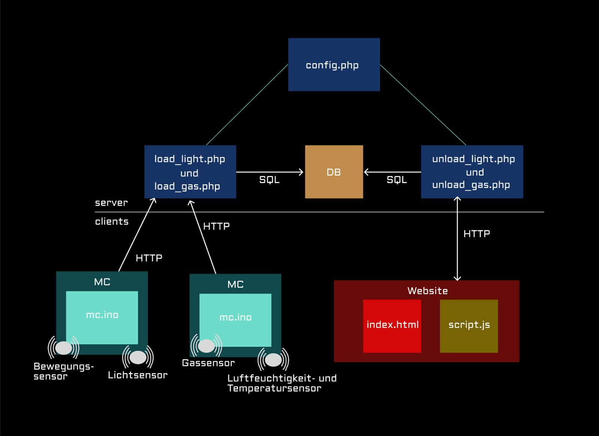
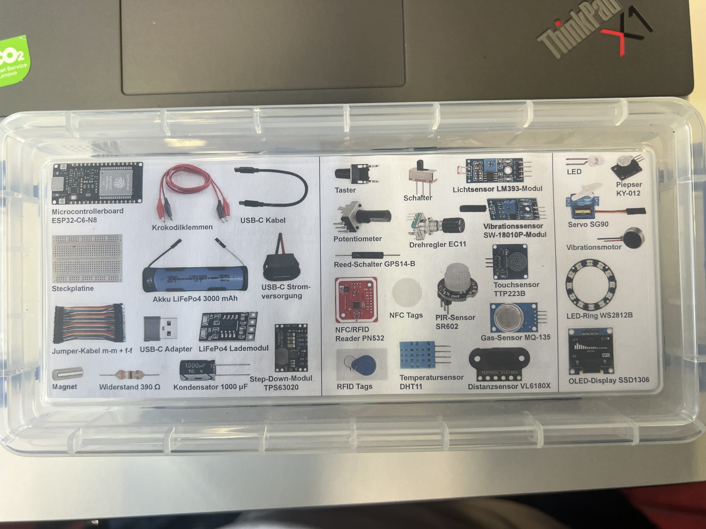
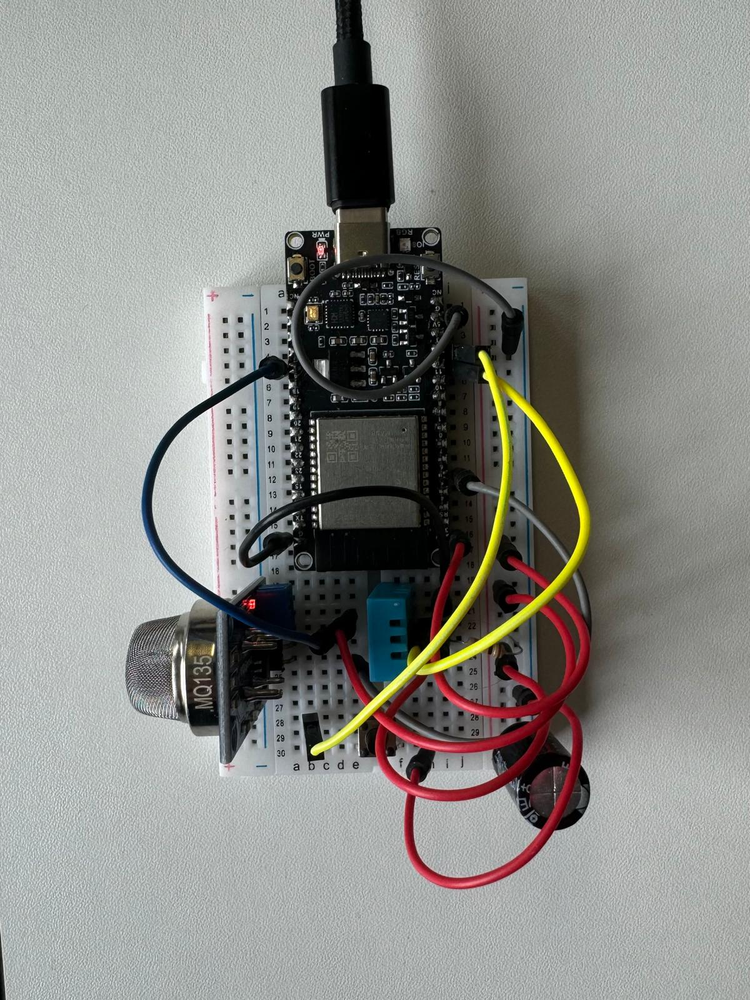
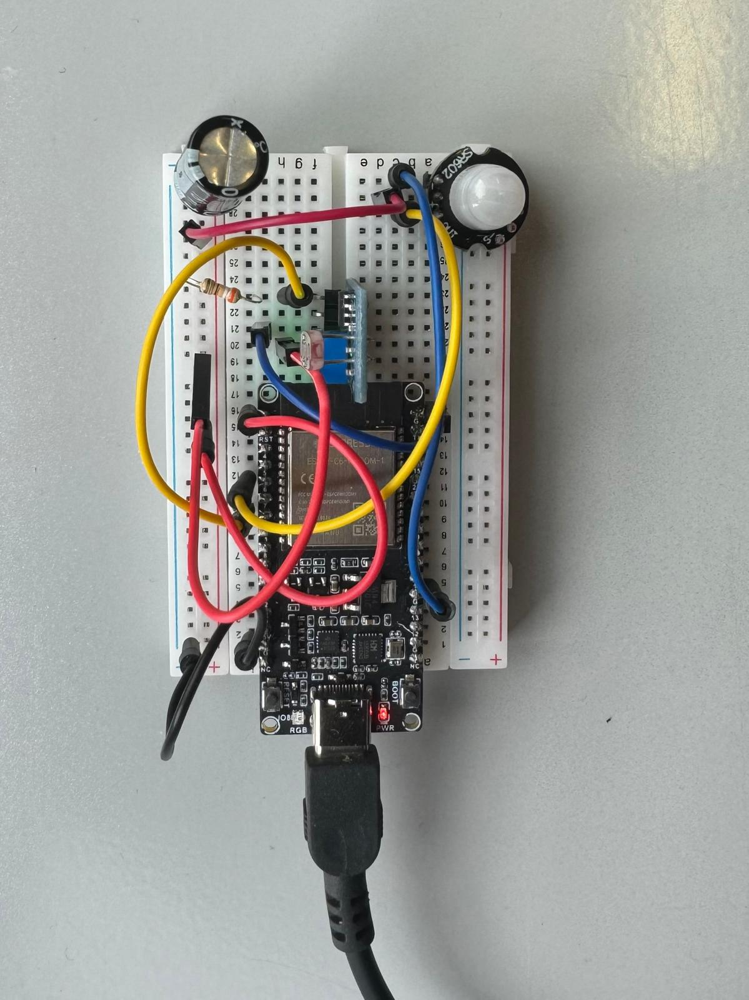

# larry

Wir haben einen Arduino Microcontroller programmiert und im Microcontrollerboard mit den nötigen Sensoren ausgestattet, dass er die Luftqualität misst und an eine WebApp schickt. Das selbe haben wir auch noch mit einem Licht- sowie Bewegungssensor gemacht. Die Steckpläne folgen in der Anleitung. Auf der WebApp können die aktuellen Daten angeschaut werden. Zudem können Push-Benachrichtigungen aktiviert werden um eine Erinnerung zum Lüften bzw. Licht ausschalten zu erhalten.

# Flussdiagram

# Projektübersicht

| Bereich         | Technologie                    |
| --------------- | ------------------------------ |
| Microcontroller | Arduino (ESP32/ESP)        |
| Sensoren        | DHT11, MQ135, PIR, Lichtsensor |
| Backend         | PHP, JSON                      |
| Frontend        | HTML, CSS, JavaScript          |
| Hosting         | Infomaniak (o. ä.)             |

Verfügbare Technik bei diesem Projekt

# Steckpläne

# 🛠️ Projektanleitung: „larry“ Schritt für Schritt
Diese Anleitung zeigt dir, wie du das Projekt **„larry“** ausschließlich anhand der Git-Commits und des Mikrocontroller-Codes nachbauen kannst.

## 1. 🟢 Initialer Hardware-Upload: Mikrocontroller-Code

**Dateien:**  
- `luftquality_upload.ino`  
- `licht_upload.ino`

**Bauen der Micocontrollerboards**

Luftqualitäts-Sensor:

Lichtsensor:

**Code:**

- Programmierung von zwei Mikrocontroller-Skripten zur Umweltüberwachung.
- `luftquality_upload.ino`: DHT11 (Temp. + Feuchte), MQ135 (Luftqualität), Kalibrierungsknopf, HTTP POST an PHP-Server.
- `licht_upload.ino`: Lichtmessung und Bewegungserkennung, ebenfalls POST an Server.
- Speicherung von Kalibrierungswerten mit `Preferences`.

✅ Damit wurde die physische Messinfrastruktur vollständig umgesetzt.

---

## 2. 🟡 Aufbau der Weboberfläche (Frontend)

**Dateien:**  
- `index.html`  
- `style.css`  
- `script.js`

**Code:**

- Grundgerüst der Weboberfläche: Platzhalter für Messdaten, responsives CSS-Layout.
- JavaScript-Logik zum Abrufen von Sensordaten über `fetch`.

✅ Erste Sichtbarkeit der Sensordaten über den Browser.

---

## 3. 🔵 Serverintegration (Backend)

**Dateien:**  
- `config.php`
- `load_gas.php`  
- `load_light.php`  

**Code:**

- PHP-Skripte zum Empfangen der POST-Daten von Mikrocontrollern.
- Rückgabe der Daten im JSON-Format an das Frontend.

✅ Verbindung zwischen Hardware und Webinterface hergestellt.

---

## 4. 🟣 Visualisierung der Umweltdaten

**Dateien:**  
- Erweiterung von `script.js`  
- Chart.js

**Codeänderungen**

- Darstellung von Temperatur-, Feuchte- und Luftqualitätsverläufen als Text bzw. Diagramme.
- Leichtere Interpretation der Daten.

✅ Benutzerfreundliche grafische Oberfläche.

---

## 5. 🟤 Optimierung der Sensorlogik

**Codeänderungen**

- Anpassung der Kalibrierung (z.B. mehr Samples, genauere Berechnung).
- Neue Schwellwerte für Lichtsensor.
- Verbesserte Fehlerbehandlung (z.B. `isnan` bei DHT11).

✅ Genaue und robuste Messlogik.

---

## 6. ⚫ Code Cleanup und kleinere Fehlerbehebungen

**Codeänderungen**

- Debug-Ausgaben entfernt, Kommentare verbessert.
- Dateistruktur aufgeräumt.

✅ Projekt ist wartbarer und übersichtlicher.

## 7. Bericht zum Umsetzungsprozess 

**Entwicklungsprozess** 
Zu Beginn testeten wir verschiedene Sensoren und überlegten, welche davon spannend und sinnvoll einsetzbar wären. Danach orientierten wir uns an typischen Alltagsproblemen unserer Eltern – sie entsprechen unserer Zielgruppe – und entwickelten darauf basierend die Projektidee weiter. Dank der physischen Komponente mit den Microcontroller-Boards konnten wir kontinuierlich Testläufe durchführen und direkt überprüfen, ob alles wie geplant funktioniert oder ob Anpassungen nötig waren. Dieser iterative Prozess half uns, praxisnah zu entwickeln und Probleme frühzeitig zu erkennen und zu lösen.

**Verworfene Lösungsansätze**
Ursprünglich war geplant, lediglich zu messen, ob das Licht an oder aus ist. Im Laufe des Projekts wurde dieser Ansatz jedoch erweitert: Nun wird  erfasst, wie oft das Licht eingeschaltet wurde und wie häufig es länger als zehn Minuten ohne erkannte Bewegung angelassen wurde. Auch die Funktionen „Box Büro“ und „Add Box“ wurden verworfen. Sie hätten dazu gedient, Informationen zur jeweiligen Box anzuzeigen oder eine neue Box hinzuzufügen. Da diese Funktionen aber nur bei aktivem Gebrauch sinnvoll gewesen wären, entschieden wir uns, sie hier nicht weiterzuverfolgen.

**Fehlschläge und Umplanung**
Einige geplante Funktionen und Konzepte erwiesen sich im Praxistest als nicht praktikabel. Die erwähnten Box-Funktionen wurden gestrichen, weil sie zu komplex in der Umsetzung und nicht notwendig für das Endprodukt waren.

**Herausforderungen**
Eine besondere Herausforderung stellte das Berechnen eines sinnvollen Ratios zur Luftqualität dar. Wir wollten ein Verhältnis definieren, das sowohl aussagekräftig als auch verständlich ist – eine zufriedenstellende Lösung wurde bislang jedoch nicht gefunden. Weitere Schwierigkeiten ergaben sich bei der WLAN-Verbindung, da das System nicht immer im Testnetzwerk betrieben wurde. Zudem musste der Cache im Browser häufig manuell geleert werden, weil Änderungen an der Webapp sonst nicht angezeigt wurden, was regelmäßig für Verwirrung sorgte.

**Angabe zu Lerneffekt**
Trotz der Herausforderungen war der Lerneffekt sehr groß. Die Implementierung von Push-Benachrichtigungen stellte sich als einfacher heraus als gedacht. Auch die Programmierung mit C++ bzw. der Arduino-Sprache war neu für uns und ermöglichte wertvolle Einblicke in die direkte Anwendung von Microcontroller-Boards im realen Kontext – insbesondere der physische, realitäts Aspekt war spannend. Darüber hinaus haben wir den Umgang mit Chart.js gelernt und konnten damit Daten visuell aufbereiten und als Graphen in der Webapp darstellen.

**Known Bugs**
Aktuell gibt es noch einige bekannte Fehler. Der Bewegungssensor löst manchmal aus, obwohl keine Bewegung stattgefunden hat – vermutlich ist er zu empfindlich eingestellt. Zudem werden Push-Benachrichtigungen nicht immer zuverlässig ausgelöst, obwohl die Bedingungen dafür erfüllt sind.

**Aufgabenverteilung, Planung**
Unsere Arbeitsweise war stark auf Tagesziele ausgerichtet. Morgens und mittags wurden konkrete Ziele für den restlichen Tag festgelegt, die wir möglichst erreichen wollten. Der Projektstart umfasste die Arbeit mit dem Arduino-Code sowie das physische Stecken des Boards und das Hochladen des Codes. Die Backend-Umsetzung übernahm Jan, während sich Anna-Maria auf das Frontend konzentrierte.

**Hilfsmittel**
Für die Umsetzung kamen mehrere Hilfsmittel zum Einsatz. ChatGPT unterstützte uns bei der Formulierung von Code und Konzepten. Die offizielle Chart.js-Website diente als Ressource zur Erstellung der Graphen, und W3Schools half uns beim allgemeinen Umgang mit HTML, CSS und JavaScript.

## Videodokumentation Larry 

"Videoerklärung_Larry"

https://drive.google.com/drive/folders/1_WZ81mAndD9u28l99daqevF881yayURI

